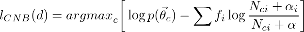

# Bayes
Python implementations of Naive Bayes algorithm variations with sklearn-like API.

## Algorithms

### Complement Naive Bayes

<p align='justify'>
Complement Naive Bayes was coined as a way to tackle some Naive Bayes limitations. 
It was presented in 2003 in the paper
 <i><a href='https://people.csail.mit.edu/jrennie/papers/icml03-nb.pdf'>Tackling the Poor Assumptions of Naive Bayes Text Classifiers</a></i>
 by Rennie J. D. M. et al. 
According to the authors, classic Naive Bayes Classifier tends to be biased in case of skewed data. 
Obviously, this characteristic is just a feature of NB classifier, but in some situations it may be cause misclassification.  
The point is to compute probability for a given class <i>c</i> on all the classes except <i>c</i>.
</p>




## Usage

Bayes classifiers API mimics [Scikit-Learn](http://scikit-learn.org/stable/modules/classes.html) API, so usage is very simple.


``` python
from Bayes import ComplementNB
from sklearn.datasets import fetch_20newsgroups
from sklearn.feature_extraction.text import CountVectorizer


vectorizer = CountVectorizer()
categories = ['alt.atheism', 'talk.religion.misc',
              'comp.graphics', 'sci.space']

# Train set
newsgroups_train = fetch_20newsgroups(subset='train',
                                          categories=categories, shuffle=True)
X_train = vectorizer.fit_transform(newsgroups_train.data)
y_train = newsgroups_train.target

# Test set
newsgroups_test = fetch_20newsgroups(subset='test',
                                          categories=categories, shuffle=True)
X_test = vectorizer.fit_transform(newsgroups_test.data)
y_test = newsgroups_test.target

# Score 
cnb = ComplementNB()
cnb.fit(X_train, y_train).accuracy_score(X_test, y_test)
```


## TODO list
* Weighted Complement Naive Bayes
* Negation Naive Bayes
* Locally Weighted Naive Bayes
* Add project Wiki
